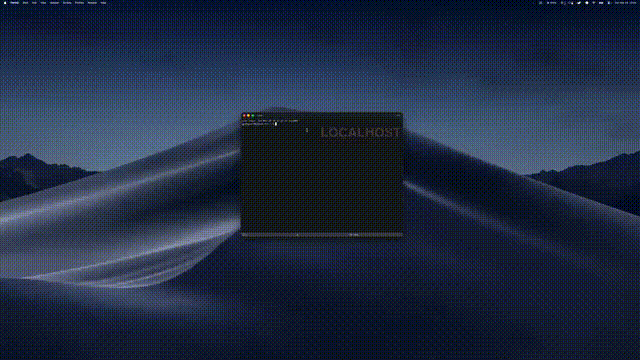

# WindowDity

A Window Tidy-inspired macOS window management app, built entirely by an AI agent loop.

This project is an example of what [looprinter](https://github.com/tapesymbolstate/looprinter) can produce — a self-contained iterative agent harness that plans, builds, verifies, and tests code autonomously.



## What it does

WindowDity is a macOS window management app inspired by [Window Tidy](https://lightpillar.com/window-tidy.html). It helps you organize windows by snapping them to predefined layouts.

**How it works:**
1. Grab any window and start dragging it
2. Layout thumbnails appear as a strip on screen (e.g. Left Half, Right Half, Full Screen)
3. Drop the window onto a thumbnail — it snaps to that layout
4. Thumbnails fade out

**Customization:**
- Create your own grid-based layouts in Preferences (name, grid size, select cells)
- Reorder, edit, or remove layouts
- Configure where the overlay strip appears (position, orientation, size)

## How it was built

No code was written manually. The entire app was produced through 5 iterations of the loop harness:

1. **Initial interview** — `/looprinter-interview` configured `loop.sh` prompts
2. **UX correction** — user clarified drag-and-drop UX, prompts updated
3. **User-defined layouts** — reference screenshots drove architecture redesign
4. **Bug fixes** — Preferences opening fix, UI refinement
5. **Positioning tab** — overlay strip placement settings added

Each iteration: update prompts in `loop.sh` -> run `./loop.sh claude` -> test -> repeat.

See [loop-interview.md](loop-interview.md) for the full iteration history.

## Requirements

- macOS 13+ (Ventura or later)
- Xcode Command Line Tools (`xcode-select --install`)

## Install as a macOS app

To use WindowDity like a normal app (launch from Spotlight/Launchpad, runs in the
menu bar), build and install the `.app` bundle:

```bash
cd WindowDity
./build-app.sh                 # build + sign + install to /Applications
```

This compiles a release build, packages it into `WindowDity.app` with an icon,
ad-hoc code-signs it, and copies it to `/Applications` (falling back to
`~/Applications` if that isn't writable). Then launch it from Spotlight or:

```bash
open /Applications/WindowDity.app
```

Other options:

```bash
./build-app.sh --no-install    # just build ./build/WindowDity.app
./build-app.sh ~/Applications  # install to a specific folder
./make-icon.sh                 # regenerate AppIcon.icns
```

WindowDity is a menu-bar app — look for the `▥` icon in the top-right menu bar
(it does not appear in the Dock). Quit it from there.

> **Note:** the build is ad-hoc signed for personal use (no Apple Developer
> account / notarization). Because a rebuild changes the signature, you may need
> to re-grant Accessibility after reinstalling.

### Run from source (development)

```bash
cd WindowDity
swift build       # compile
swift run          # build + launch
```

## Accessibility permission

On first launch, macOS asks for Accessibility permission. Grant it at:
**System Settings > Privacy & Security > Accessibility > WindowDity** (toggle it on).

This is required for the app to move and resize other windows. If snapping does
nothing, this toggle is almost always the reason — toggle it off and on after a
reinstall.

### Launch at login (optional)

**System Settings > General > Login Items > "Open at Login"** → add
`WindowDity.app`.

## What is looprinter?

[looprinter](https://github.com/tapesymbolstate/looprinter) is a loop template for building iterative agent harnesses. You copy `loop.sh`, edit the prompt functions to describe what you want to build, and run it. The loop handles the rest:

```
Setup → Plan → Build (one task per agent call) → Verify → Done
                ↑                                    |
                └── re-plan with error context ──────┘ (if verify fails)
```

The key insight is the **two-loop architecture**:
- **Inner loop** (loop.sh) — headless agents iterate through plan tasks automatically
- **Outer loop** (you) — observe results, refine prompts, re-run

This project went through 5 outer-loop iterations. Each time, the human updated the prompts based on testing feedback, and the inner loop rebuilt the app from the new instructions.

## Tech

- Swift + AppKit (native macOS)
- AXUIElement API for window control
- Global NSEvent monitoring for drag detection
- SwiftUI for Preferences UI

## Project structure

```
loop.sh                     — looprinter harness (prompts + engine)
SPEC.md                     — product spec
loop-interview.md           — iteration history
references/                 — UI reference screenshots
WindowDity/
  Package.swift             — Swift Package (macOS 13+)
  Sources/
    AppDelegate.swift       — orchestrator (drag -> overlay -> snap)
    DragDetector.swift      — global mouse event monitor
    OverlayManager.swift    — overlay window strip
    OverlayView.swift       — layout thumbnail with hover highlight
    Layout.swift            — grid-based layout model (Codable)
    LayoutStore.swift       — layout persistence (UserDefaults JSON)
    LayoutEditorView.swift  — layout editor (name, grid, cell selection)
    PreferencesView.swift   — Preferences window (Layouts, Options, Positioning)
    WindowManager.swift     — AXUIElement move + resize
    WindowDityApp.swift     — entry point
```
